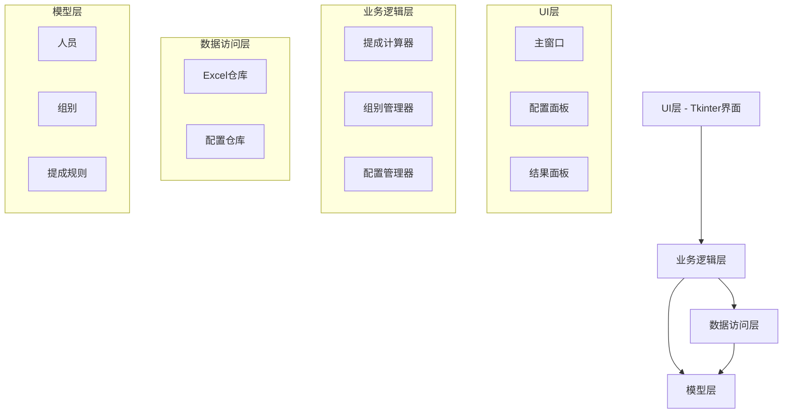
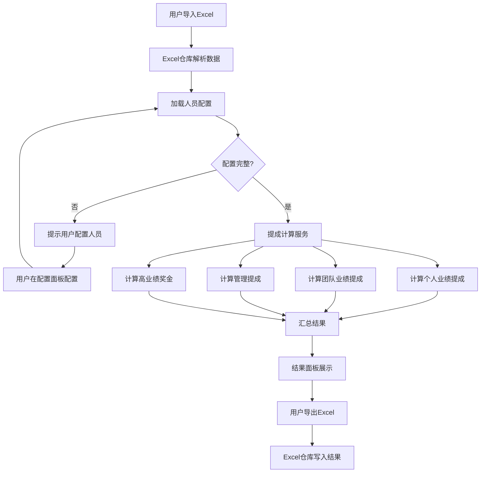
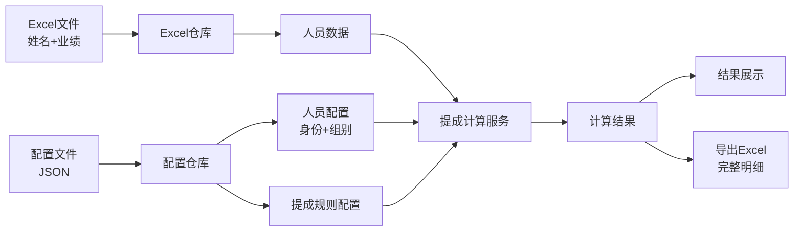

# CommissionCalc 系统设计文档

## 项目信息

- **项目类型**: 桌面应用程序
- **平台**: Windows
- **语言/运行时**: Python 3.8+
- **构建方法**: 直接运行 Python 脚本
- **CI/CD状态**: 暂无

## 技术栈

- **语言**: Python 3.8+
- **GUI框架**: Tkinter（Python内置）
- **数据处理**: pandas + openpyxl（Excel读写）
- **配置存储**: JSON文件
- **测试框架**: pytest

## 系统概述

CommissionCalc是一款绩效提成自动计算工具，用于根据员工业绩自动计算各类提成和奖金。

### 核心功能

1. **业绩数据导入**: 从Excel导入姓名和业绩数据
2. **人员配置**: 在UI中配置人员身份（总主管/组长/成员）和组别
3. **提成规则配置**: 在UI中配置提成阶梯、管理提成、高业绩奖金
4. **自动计算**: 根据配置自动计算各类提成
5. **结果导出**: 导出详细的提成明细到Excel

### 提成计算规则

#### 1. 个人业绩提成
- **计算方式**: 全额计算（达到阶梯后，全部业绩按该阶梯比例计算）
- **阶梯规则**:
  - 0-3000元: 0%
  - 3000元以上: 20%
- **示例**: 业绩5000元 → 5000 × 0.2 = 1000元

#### 2. 团队业绩提成（组长）
- **计算方式**: 全额计算
- **计算依据**: 组内所有成员业绩累加
- **阶梯规则**:
  - 0-3000元: 0%
  - 3000-10000元: 10%
  - 10000元以上: 20%
- **示例**: 组员业绩合计15000元 → 15000 × 0.2 = 3000元

#### 3. 团队业绩提成（总主管）
- **计算方式**: 全额计算
- **计算依据**: 所有成员业绩累加
- **阶梯规则**: 同组长团队业绩提成

#### 4. 组长管理提成
- **计算方式**: 固定金额
- **规则**: 组内成员数量 × 100元
- **示例**: 组内有3名成员 → 3 × 100 = 300元

#### 5. 高业绩奖金
- **计算方式**: 累加计算（达到多个阶梯则累加）
- **阶梯规则**:
  - 业绩达到2万: 500元
  - 业绩达到3万: 1000元
  - 业绩达到5万: 2000元
- **示例**: 业绩35000元 → 达到2万(500) + 达到3万(1000) = 1500元

## 系统架构

采用**分层架构**设计，确保职责清晰、易于测试和维护。

### 架构图



### 项目结构

```
CommissionCalc/
├── src/
│   ├── models/              # 数据模型层
│   │   ├── __init__.py
│   │   ├── person.py           # 人员实体
│   │   ├── group.py            # 组别实体
│   │   └── commission.py       # 提成规则模型
│   ├── services/            # 业务逻辑层
│   │   ├── __init__.py
│   │   ├── calculator.py       # 提成计算服务
│   │   ├── group_manager.py    # 组别管理服务
│   │   └── config_manager.py   # 配置管理服务
│   ├── repositories/        # 数据访问层
│   │   ├── __init__.py
│   │   ├── excel_repo.py       # Excel读写仓库
│   │   └── config_repo.py      # 配置持久化仓库
│   └── ui/                  # 用户界面层
│       ├── __init__.py
│       ├── main_window.py      # 主窗口
│       ├── config_panel.py     # 配置管理面板
│       └── result_panel.py     # 结果展示面板
├── config/                  # 配置文件目录
│   ├── settings.json           # 系统配置
│   └── commission_rules.json   # 提成规则配置
├── tests/                   # 单元测试
│   ├── test_calculator.py
│   ├── test_group_manager.py
│   └── test_excel_repo.py
├── docs/                    # 文档
│   └── design/
│       └── README.md
├── requirements.txt         # 依赖清单
├── .gitignore
└── main.py                  # 程序入口
```

## 数据模型

### Person（人员）

```python
class Person:
    id: str                    # 唯一标识（UUID）
    name: str                  # 姓名
    performance: float         # 个人业绩
    role: Role                 # 身份枚举
    group_id: Optional[str]    # 所属组别ID（总主管可为空）

class Role(Enum):
    GENERAL_MANAGER = "总主管"  # 仅一位
    TEAM_LEADER = "组长"
    MEMBER = "成员"
```

### Group（组别）

```python
class Group:
    id: str                    # 组别唯一标识（UUID）
    name: str                  # 组别名称
    leader_id: str             # 组长ID
    members: List[str]          # 成员ID列表
```

### CommissionRule（提成规则）

```python
class CommissionRule:
    rule_type: RuleType        # 规则类型枚举
    tiers: List[Tier]          # 阶梯配置

class RuleType(Enum):
    PERSONAL = "个人业绩提成"
    TEAM = "团队业绩提成"
    MANAGEMENT = "管理提成"
    HIGH_BONUS = "高业绩奖金"

class Tier:
    min_amount: float          # 最低金额
    max_amount: Optional[float] # 最高金额（None表示无上限）
    rate: Optional[float]       # 提成比例（管理提成为None）
    bonus: Optional[float]      # 奖金金额（仅高业绩奖金）
```

### Config（系统配置）

```python
class Config:
    personal_commission: CommissionRule      # 个人业绩提成规则
    team_commission: CommissionRule          # 团队业绩提成规则
    management_bonus_per_person: float       # 组长管理提成（每人）
    high_performance_bonuses: List[Bonus]    # 高业绩奖金配置
    
class Bonus:
    threshold: float            # 业绩阈值
    amount: float               # 奖金金额
```

## 业务逻辑流程

### 提成计算流程



### 核心计算逻辑

#### 个人业绩提成计算

```python
def calculate_personal_commission(performance: float, rule: CommissionRule) -> float:
    """计算个人业绩提成（全额计算）"""
    for tier in rule.tiers:
        if tier.min_amount <= performance:
            if tier.max_amount is None or performance < tier.max_amount:
                return performance * tier.rate
    return 0.0
```

#### 团队业绩提成计算

```python
def calculate_team_commission(team_performance: float, rule: CommissionRule) -> float:
    """计算团队业绩提成（全额计算）"""
    for tier in rule.tiers:
        if tier.min_amount <= team_performance:
            if tier.max_amount is None or team_performance < tier.max_amount:
                return team_performance * tier.rate
    return 0.0
```

#### 高业绩奖金计算

```python
def calculate_high_performance_bonus(performance: float, bonuses: List[Bonus]) -> float:
    """计算高业绩奖金（累加计算）"""
    total_bonus = 0.0
    for bonus in bonuses:
        if performance >= bonus.threshold:
            total_bonus += bonus.amount
    return total_bonus
```

## 用户界面设计

### 主窗口布局

```
+----------------------------------------------------------+
|  绩效提成计算系统                            [最小化][关闭] |
+----------------------------------------------------------+
| [导入业绩] [导出结果] [配置管理]                           |
+----------------------------------------------------------+
| 文件路径：[________________] [选择文件]                   |
|                                                           |
| 业绩数据预览：                                            |
| +---------------------------------------------------+    |
| | 姓名 | 业绩   | 身份   | 组别   |                |    |
| | 张三 | 5000   | 组长   | A组    |                |    |
| | 李四 | 3000   | 成员   | A组    |                |    |
| +---------------------------------------------------+    |
|                                                           |
| [计算提成]                                                |
|                                                           |
| 结果汇总：                                                |
| +---------------------------------------------------+    |
| | 姓名 | 个人提成 | 团队提成 | 管理提成 | 奖金 | 总计 |    |
| | 张三 | 1000     | 800      | 200      | 500  | 2500 |    |
| +---------------------------------------------------+    |
+----------------------------------------------------------+
```

### 配置管理窗口

#### 标签页1：人员管理
- 人员列表表格（姓名、身份、组别）
- 添加/编辑/删除按钮
- 下拉选择身份和组别

#### 标签页2：提成规则配置
- 个人业绩提成阶梯配置（可动态添加/删除阶梯）
- 团队业绩提成阶梯配置
- 组长管理提成金额输入
- 高业绩奖金阈值配置（可动态添加/删除）

#### 标签页3：数据管理
- 导出当前配置按钮
- 导入配置按钮
- 重置为默认值按钮

## 数据流图



## 测试策略

### 单元测试

优先测试核心计算逻辑，确保财务计算准确。

#### test_calculator.py - 提成计算测试

```python
def test_personal_commission_below_threshold():
    """个人业绩未达3000元，提成为0"""
    assert calculate_personal_commission(2500, rule) == 0

def test_personal_commission_above_threshold():
    """个人业绩超过3000元，按20%计算"""
    assert calculate_personal_commission(5000, rule) == 1000

def test_team_commission_tier1():
    """团队业绩3000-10000，按10%计算"""
    assert calculate_team_commission(8000, rule) == 800

def test_team_commission_tier2():
    """团队业绩超过10000，按20%计算"""
    assert calculate_team_commission(15000, rule) == 3000

def test_management_bonus():
    """组长管理提成 = 成员数 × 100"""
    assert calculate_management_bonus(5) == 500

def test_high_performance_bonus_single():
    """业绩25000，达到2万，奖金500"""
    assert calculate_high_performance_bonus(25000, bonuses) == 500

def test_high_performance_bonus_multiple():
    """业绩35000，达到2万+3万，奖金1500"""
    assert calculate_high_performance_bonus(35000, bonuses) == 1500

def test_high_performance_bonus_all():
    """业绩55000，达到2万+3万+5万，奖金3500"""
    assert calculate_high_performance_bonus(55000, bonuses) == 3500
```

#### test_group_manager.py - 组别管理测试

```python
def test_add_member_to_group():
    """测试添加成员到组"""

def test_remove_member_from_group():
    """测试从组中移除成员"""

def test_calculate_team_performance():
    """测试计算团队总业绩"""
```

#### test_excel_repo.py - Excel读写测试

```python
def test_import_performance_data():
    """测试导入业绩数据"""

def test_export_commission_results():
    """测试导出提成结果"""

def test_invalid_excel_format():
    """测试Excel格式错误处理"""
```

### 集成测试

- 测试完整流程：导入Excel → 配置人员 → 计算提成 → 导出结果
- 测试配置持久化：配置修改后保存，重启程序后加载

### 测试覆盖率目标

- 核心计算逻辑: 100%
- 业务逻辑层: 80%+
- 数据访问层: 70%+
- UI层: 手动测试为主

## 错误处理

### 数据验证

1. **Excel文件格式验证**
   - 必须包含"姓名"列
   - 必须包含"业绩"列
   - 业绩数据必须为数字

2. **人员配置验证**
   - 总主管只能有一位
   - 组长必须分配到组
   - 成员必须分配到组

3. **业务规则验证**
   - 提成比例必须为0-1之间
   - 阶梯金额必须递增
   - 管理提成金额必须为正数

### 用户提示

- **数据缺失**: "以下人员缺少身份配置：张三、李四。请在配置管理中完善。"
- **Excel格式错误**: "Excel文件缺少'姓名'列，请检查文件格式。"
- **业务规则错误**: "提成比例必须在0-1之间，当前值：1.5"

### 日志记录

- INFO: 正常操作日志（导入导出、计算完成）
- WARNING: 数据缺失警告
- ERROR: 异常错误（文件读取失败、计算异常）

## 扩展性考虑

### 配置灵活化

- 提成规则完全可配置，支持动态添加阶梯
- 支持不同部门不同提成规则（未来扩展）

### 国际化支持

- 预留语言包接口，支持中英文切换

### 数据库扩展

- 当前使用JSON文件存储配置，未来可迁移到SQLite数据库

### 多平台支持

- 当前Windows + Tkinter，可迁移到Web界面（Flask/FastAPI）

## 开发计划

### 第一阶段：核心功能
1. 搭建项目结构
2. 实现数据模型
3. 实现提成计算逻辑（含单元测试）
4. 实现Excel读写
5. 实现基础UI

### 第二阶段：配置功能
1. 实现人员配置管理
2. 实现提成规则配置
3. 实现配置持久化

### 第三阶段：完善优化
1. 完善UI交互
2. 添加错误处理和验证
3. 添加日志记录
4. 性能优化

### 第四阶段：测试和发布
1. 完善单元测试
2. 集成测试
3. 用户手册编写
4. 打包发布

## 技术风险

1. **Excel兼容性**: openpyxl可能不支持旧版Excel格式，需要用户保存为xlsx格式
2. **并发问题**: 单机应用，无并发风险
3. **数据安全**: 配置文件明文存储，敏感信息需加密（如需要）
4. **性能问题**: 大数据量（10000+条）时，需要优化Excel读取性能

## 依赖清单

```
pandas>=1.3.0
openpyxl>=3.0.0
pytest>=6.0.0
```

## 总结

本系统采用分层架构设计，职责清晰，易于测试和维护。核心提成计算逻辑通过单元测试确保准确性，配置灵活可扩展。UI设计简洁直观，用户易于上手。