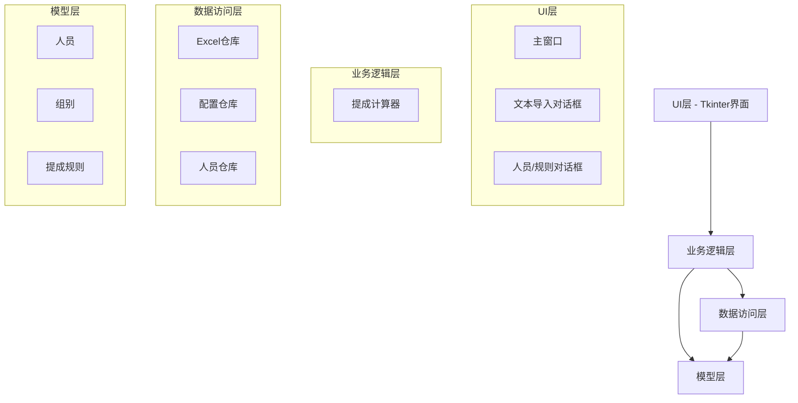
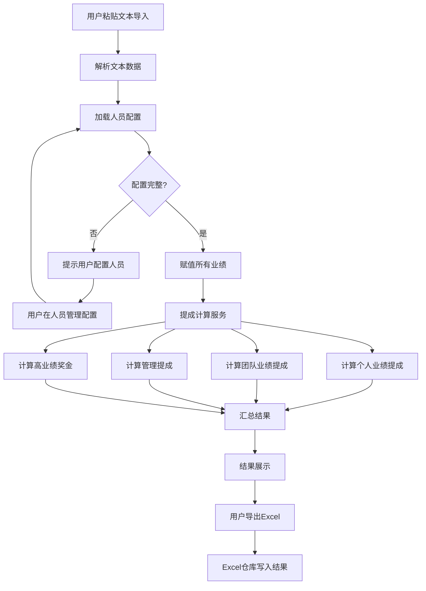
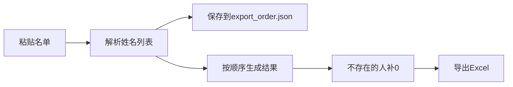

# CommissionCalc 系统设计文档

## 项目信息

- **项目类型**: 桌面应用程序
- **平台**: Windows
- **语言/运行时**: Python 3.8+
- **构建方法**: PyInstaller打包
- **CI/CD状态**: 暂无

## 技术栈

- **语言**: Python 3.8+
- **GUI框架**: Tkinter（Python内置）
- **数据处理**: pandas + openpyxl（Excel读写）
- **配置存储**: JSON文件
- **测试框架**: pytest
- **打包工具**: PyInstaller

## 系统概述

CommissionCalc是一款绩效提成自动计算工具，用于根据员工业绩自动计算各类提成和奖金。

### 核心功能

1. **业绩数据导入**: 粘贴文本导入姓名和业绩数据（制表符分隔）
2. **人员配置**: 在UI中配置人员身份（总主管/组长/成员）和组别
3. **提成规则配置**: 在UI中配置提成阶梯、达标线、管理提成、高业绩奖金
4. **自动计算**: 根据配置自动计算各类提成
5. **结果导出**: 导出详细的提成明细到Excel
   - 支持粘贴名单自定义导出顺序
   - 不存在的人员数据补0
   - 导出顺序可保存到配置，下次复用
6. **配置自动修复**: 启动时自动修复组成员关系不一致

### 提成计算规则

#### 1. 个人业绩提成
- **计算方式**: 全额计算（达到阶梯后，全部业绩按该阶梯比例计算）
- **阶梯规则**:
  - 0-3000元: 0%
  - 3000元以上: 20%
- **示例**: 业绩5000元 → 5000 × 0.2 = 1000元

#### 2. 团队业绩提成（组长）
- **计算方式**: 全额计算
- **计算依据**: 组内所有达标业绩累加（>=达标线，默认3000元），包含组长自己
- **阶梯规则**:
  - 0-10000元: 0%
  - 10000-50000元: 10%
  - 50000元以上: 20%
- **示例**: 组长20000 + 成员A 40000(达标) + 成员B 2000(未达标) → 60000 × 0.2 = 12000元

#### 3. 团队业绩提成（总主管）
- **计算方式**: 全额计算
- **计算依据**: 所有达标业绩累加（>=达标线，默认50000元），包含总主管自己
- **达标线**: 独立配置，与组长分开
- **阶梯规则**（独立配置）:
  - 0-50000元: 0%
  - 50000元以上: 10%
- **示例**: 总主管50000(达标) + 组长20000(达标) + 成员40000(达标) → 110000 × 0.1 = 11000元

#### 4. 组长管理提成
- **计算方式**: 固定金额
- **规则**: 组内成员数量 × 100元（不要求成员达标）
- **示例**: 组内有2名成员 → 2 × 100 = 200元

#### 5. 高业绩奖金
- **计算方式**: 不累加，取最高梯度
- **阶梯规则**:
  - 业绩达到2万: 500元
  - 业绩达到3万: 1000元
  - 业绩达到5万: 2000元
- **示例**: 业绩35000元 → 达到3万 = 1000元

## 系统架构

采用**分层架构**设计，确保职责清晰、易于测试和维护。

### 架构图



### 项目结构

```
CommissionCalc/
├── src/
│   ├── models/              # 数据模型层
│   │   ├── __init__.py
│   │   ├── person.py           # 人员实体
│   │   ├── group.py            # 组别实体
│   │   ├── role.py             # 身份枚举
│   │   ├── commission.py       # 提成规则模型
│   │   └── config.py           # 系统配置
│   ├── services/            # 业务逻辑层
│   │   ├── __init__.py
│   │   └── calculator.py       # 提成计算服务
│   ├── repositories/        # 数据访问层
│   │   ├── __init__.py
│   │   ├── excel_repo.py       # Excel读写仓库
│   │   ├── config_repo.py      # 配置持久化仓库
│   │   └── people_repo.py      # 人员配置仓库
│   ├── ui/                  # 用户界面层
│   │   ├── __init__.py
│   │   ├── main_window.py      # 主窗口
│   │   ├── dialogs.py          # 各类对话框
│   │   ├── text_import_dialog.py  # 文本导入对话框
│   │   └── utils.py            # UI辅助函数
│   └── utils/               # 工具模块
│       └── logger.py            # 日志模块
├── config/                  # 配置文件目录
│   ├── settings.json           # 系统配置
│   └── people.json             # 人员配置
├── log/                     # 日志文件目录
├── tests/                   # 单元测试
│   ├── models/
│   ├── services/
│   └── repositories/
├── docs/                    # 文档
│   ├── design/
│   ├── requirements.md
│   └── terminology.md
├── scripts/                 # 构建脚本
│   └── build.ps1
├── requirements.txt         # 依赖清单
├── .gitignore
└── main.py                  # 程序入口
```

## 数据模型

### Person（人员）

```python
class Person:
    id: str                    # 唯一标识（UUID）
    name: str                  # 姓名
    performance: float         # 个人业绩（默认0）
    role: Role                 # 身份枚举
    group_id: Optional[str]    # 所属组别ID

class Role(Enum):
    GENERAL_MANAGER = "总主管"  # 仅一位
    TEAM_LEADER = "组长"
    MEMBER = "成员"
```

### Group（组别）

```python
class Group:
    id: str                    # 组别唯一标识（UUID）
    name: str                  # 组别名称
    leader_id: str             # 组长ID
    members: List[str]         # 成员ID列表
```

### Config（系统配置）

```python
class Config:
    personal_commission: CommissionRule      # 个人业绩提成规则
    team_commission: CommissionRule          # 团队业绩提成规则
    management_bonus_per_person: float       # 组长管理提成（每人）
    high_performance_bonuses: List[Bonus]    # 高业绩奖金配置
    eligible_performance_threshold: float    # 达标线（默认3000）
```

## 业务逻辑流程

### 提成计算流程



### 核心计算逻辑

#### 高业绩奖金计算（不累加）

```python
def calculate_high_performance_bonus(performance: float, bonuses: List[Bonus]) -> float:
    """计算高业绩奖金（取最高梯度）"""
    for bonus in reversed(bonuses):
        if performance >= bonus.threshold:
            return bonus.amount
    return 0.0
```

## 用户界面设计

### 主窗口布局

```
+----------------------------------------------------------+
|  绩效提成计算系统                            [最小化][关闭] |
+----------------------------------------------------------+
| [提成计算] [人员管理] [规则配置]                           |
+----------------------------------------------------------+
| [粘贴文本导入] [计算提成] [导出结果]                       |
|                                                           |
| 业绩数据：                                                |
| +---------------------------------------------------+    |
| | 姓名 | 业绩   | 身份   | 组别   |                |    |
| | A    | 40000  | 组长   | A组    |                |    |
| | B    | 20000  | 组长   | B组    |                |    |
| +---------------------------------------------------+    |
|                                                           |
| 结果汇总：                                                |
| +---------------------------------------------------+    |
| | 姓名 | 个人提成 | 团队提成 | 管理提成 | 奖金 | 总计 |    |
| | A    | 8000     | 4000     | 200      | 500  | 12700|    |
| +---------------------------------------------------+    |
+----------------------------------------------------------+
```

### 粘贴文本导入对话框

```
+----------------------------------------------------------+
|  粘贴文本导入业绩                                         |
+----------------------------------------------------------+
| 说明：识别'姓名'列和业绩列（列名可自定义）                 |
| 业绩列名：[累计业绩    ]                                  |
| 示例：姓名    累计业绩                                    |
|       A       40000                                       |
|       B       20000                                       |
+----------------------------------------------------------+
| [粘贴区域]                                                |
| +---------------------------------------------------+    |
| | 姓名    累计业绩                                 |    |
| | A       40000                                    |    |
| | B       20000                                    |    |
| +---------------------------------------------------+    |
|                                                           |
| [识别解析] [确认结果]                                     |
|                                                           |
| 识别结果：                                                |
| +---------------------------------------------------+    |
| | 姓名 | 业绩   | 状态   |                            |    |
| | A    | 40000  | 已匹配 |                            |    |
| +---------------------------------------------------+    |
+----------------------------------------------------------+
```

## 测试策略

### 单元测试

- 核心计算逻辑: 100%覆盖
- 53个测试全部通过

### 测试目录结构

```
tests/
├── models/           # 模型测试
│   ├── test_person.py
│   ├── test_group.py
│   ├── test_role.py
│   ├── test_commission.py
│   └── test_config.py
├── services/         # 计算逻辑测试
│   ├── test_calculator_personal.py
│   ├── test_calculator_team.py
│   ├── test_calculator_management.py
│   ├── test_calculator_bonus.py
│   └── test_calculator_complete.py
└── repositories/     # 数据访问测试
    ├── test_config_repo.py
    ├── test_excel_repo.py
    └── test_people_repo.py
```

## 错误处理

### 数据验证

1. **文本格式验证**
   - 必须包含"姓名"列
   - 必须包含业绩列（列名可配置）

2. **人员配置验证**
   - 总主管只能有一位
   - 组长必须分配到组
   - 成员必须分配到组

3. **自动修复**
   - 启动时根据人员的group_id自动同步组的members列表
   - 移除无效成员ID
   - 移除group_id不匹配的成员

### 日志记录

- 文件位置: `log/YYYY-MM-DD.log`
- INFO: 计算开始/完成、人员配置变更
- DEBUG: 详细计算过程、阶梯匹配
- WARNING: 配置缺失、数据异常

## 依赖清单

```
pandas>=1.3.0
openpyxl>=3.0.0
pytest>=6.0.0
pyinstaller>=5.0.0
```

## 总结

本系统采用分层架构设计，职责清晰，易于测试和维护。核心提成计算逻辑通过单元测试确保准确性，配置灵活可扩展。支持粘贴文本导入、自动配置修复、详细日志记录等功能。

## v0.3.0 新功能设计

### 功能1：总主管独立提成配置

**数据模型改动**：

```python
# Config新增字段
gm_commission: CommissionRule       # 总主管团队提成阶梯
gm_eligible_threshold: float         # 总主管达标线（默认50000）
```

**默认值**：
- 达标线：50000元
- 阶梯：0-50000(0%), 50000+(10%)

**计算逻辑改动**：

```python
# _calculate_team_commission() 总主管分支
if person.role == Role.GENERAL_MANAGER:
    threshold = self.config.gm_eligible_threshold  # 使用总主管达标线
    eligible_people = [p for p in self.people.values() if p.performance >= threshold]
    team_performance = sum(p.performance for p in eligible_people)
    commission = calculate_team_commission(team_performance, self.config.gm_commission)  # 使用总主管阶梯
```

**UI改动**：

规则配置标签页新增独立区域：
```
总主管提成配置
├── 达标线输入框（默认50000）
├── 阶梯表格（下限、上限、比例）
└── 添加/编辑/删除阶梯按钮
```

### 功能2：自定义导出顺序

**新增配置文件**：

`config/export_order.json`：
```json
{
  "names": ["张三", "李四", "王五"]
}
```

**新增导出对话框**：

```
导出结果对话框
├── 粘贴名单区域（文本框）
├── 使用保存顺序按钮
├── 保存当前顺序按钮
└── 确认导出按钮
```

**导出逻辑**：

1. 无名单 → 按计算结果顺序导出
2. 有名单 → 按名单顺序导出，不存在的人补0

**数据流**：

