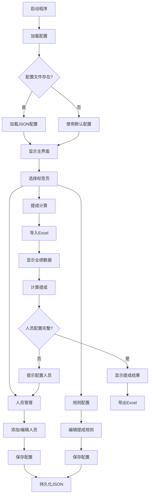

# CommissionCalc UI设计文档

## 设计概述

**布局结构**: 上下分区布局  
**配置管理方式**: 标签页集成  
**数据展示方式**: 业绩+结果双表格  
**技术栈**: Python Tkinter

## 整体架构

### 界面结构图

```
┌─────────────────────────────────────────────────┐
│  菜单栏：文件 | 帮助                              │ ← 顶部
├─────────────────────────────────────────────────┤
│  标签页：提成计算 | 人员管理 | 规则配置           │ ← 标签页栏
├─────────────────────────────────────────────────┤
│                                                 │
│  [当前标签页内容区域]                            │ ← 中间主区域
│                                                 │
├─────────────────────────────────────────────────┤
│  状态栏：显示操作提示和状态信息                   │ ← 底部
└─────────────────────────────────────────────────┘
```

### 界面流程图



## 标签页1：提成计算

### 界面设计

```
┌─────────────────────────────────────────────────┐
│ 标签页：提成计算                                 │
├─────────────────────────────────────────────────┤
│ 业绩数据表格：                                   │
│ ┌───────────────────────────────────────┐      │
│ │ 姓名 | 业绩   | 身份   | 组别   |      │      │
│ │ 张三 | 5000   | 组长   | A组    |      │      │
│ │ 李四 | 3000   | 成员   | A组    |      │      │
│ └───────────────────────────────────────┘      │
│                                                 │
│ 操作按钮：[导入业绩] [计算提成] [导出结果]       │
│                                                 │
│ 提成结果表格：                                   │
│ ┌─────────────────────────────────────────┐    │
│ │ 姓名 | 个人提成 | 团队提成 | 管理提成 | 奖金 | 总计 │ │
│ │ 张三 | 1000     | 800      | 200      | 0    | 2000 │    │
│ └─────────────────────────────────────────┘    │
└─────────────────────────────────────────────────┘
```

### 功能说明

#### 导入业绩按钮

**功能**: 导入Excel业绩数据文件

**流程**:
1. 点击按钮 → 弹出文件选择对话框
2. 选择Excel文件（支持.xlsx, .xls格式）
3. 读取Excel数据（必需列：姓名、业绩）
4. 验证Excel格式（缺少必需列则提示错误）
5. 显示业绩数据在业绩表格中
6. 自动合并人员配置信息（根据姓名匹配，显示身份和组别）

**错误处理**:
- 文件格式错误：提示"Excel文件缺少'姓名'或'业绩'列"
- 文件读取失败：提示"无法读取文件，请检查文件格式"

#### 计算提成按钮

**功能**: 计算所有人员的提成

**流程**:
1. 点击按钮 → 检查人员配置完整性
2. 检查业绩数据是否存在
3. 检查人员身份配置是否完整
4. 如果配置不完整：弹出提示对话框
   - 显示未配置人员列表
   - 提示："以下人员缺少身份配置：XXX、XXX，请先在人员管理中配置"
5. 如果配置完整：执行提成计算
6. 显示提成结果在结果表格中

**计算逻辑**:
- 遍历所有人员
- 根据身份和业绩计算各项提成
- 汇总显示在结果表格

#### 导出结果按钮

**功能**: 导出提成结果到Excel文件

**流程**:
1. 点击按钮 → 弹出文件保存对话框
2. 选择保存路径和文件名
3. 导出Excel文件，包含以下列：
   - 姓名、业绩、身份、组别
   - 个人提成、团队提成、管理提成、高业绩奖金、总提成
4. 提示导出成功

### 数据表格说明

#### 业绩数据表格

**列定义**:
| 列名 | 数据类型 | 说明 |
|------|---------|------|
| 姓名 | 字符串 | 人员姓名（来自Excel） |
| 业绩 | 数字 | 个人业绩金额（来自Excel） |
| 身份 | 字符串 | 人员身份（来自配置：总主管/组长/成员） |
| 组别 | 字符串 | 所属组别（来自配置） |

**数据来源**:
- 姓名、业绩：来自导入的Excel文件
- 身份、组别：来自人员配置（根据姓名匹配）

#### 提成结果表格

**列定义**:
| 列名 | 数据类型 | 说明 |
|------|---------|------|
| 姓名 | 字符串 | 人员姓名 |
| 个人提成 | 数字 | 个人业绩提成金额 |
| 团队提成 | 数字 | 团队业绩提成金额 |
| 管理提成 | 数字 | 组长管理提成金额 |
| 高业绩奖金 | 数字 | 高业绩奖金金额 |
| 总提成 | 数字 | 以上各项合计 |

## 标签页2：人员管理

### 界面设计

```
┌─────────────────────────────────────────────────┐
│ 标签页：人员管理                                 │
├─────────────────────────────────────────────────┤
│ 人员列表表格：                                   │
│ ┌─────────────────────────────────────┐        │
│ │ 姓名 | 身份   | 组别   | 操作       │        │
│ │ 张三 | 组长   | A组    | [编辑][删除]│        │
│ │ 李四 | 成员   | A组    | [编辑][删除]│        │
│ │ 王五 | 成员   | B组    | [编辑][删除]│        │
│ └─────────────────────────────────────┘        │
│                                                 │
│ 操作按钮：[添加人员] [批量导入] [保存配置]       │
│                                                 │
│ 提示信息：                                       │
│ - 总主管只能有一位                               │
│ - 组长必须分配到组                               │
│ - 成员必须分配到组                               │
└─────────────────────────────────────────────────┘
```

### 添加/编辑人员对话框

```
┌─────────────────────────────┐
│ 添加/编辑人员                │
├─────────────────────────────┤
│ 姓名：  [____________]       │
│                             │
│ 身份：  [下拉选择]           │
│         - 总主管             │
│         - 组长               │
│         - 成员               │
│                             │
│ 组别：  [下拉选择]           │
│         - A组                │
│         - B组                │
│         - (无)               │
│                             │
│ [取消] [确定]                │
└─────────────────────────────┘
```

### 功能说明

#### 人员列表表格

**列定义**:
| 列名 | 数据类型 | 说明 |
|------|---------|------|
| 姓名 | 字符串 | 人员姓名 |
| 身份 | 字符串 | 总主管/组长/成员 |
| 组别 | 字符串 | 所属组别 |
| 操作 | 按钮 | 编辑、删除按钮 |

**数据来源**: 来自人员配置（Person对象）

#### 添加人员按钮

**功能**: 添加新人员到配置中

**流程**:
1. 点击按钮 → 弹出添加人员对话框
2. 输入姓名，选择身份和组别
3. 点击确定 → 验证数据
4. 如果验证通过：添加到人员配置
5. 更新人员列表表格

#### 编辑人员按钮

**功能**: 编辑现有人员配置

**流程**:
1. 点击表格中的[编辑]按钮
2. 弹出编辑人员对话框（自动填充当前信息）
3. 修改信息，点击确定
4. 更新人员配置和表格

#### 删除人员按钮

**功能**: 删除人员配置

**流程**:
1. 点击表格中的[删除]按钮
2. 弹出确认对话框："确定删除人员XXX吗？"
3. 确认后删除，更新人员列表

#### 保存配置按钮

**功能**: 保存人员配置到JSON文件

**流程**:
1. 点击按钮 → 保存人员配置到config/people.json
2. 提示保存成功

### 数据验证

**验证规则**:
1. 总主管只能有一位
   - 添加总主管时，检查是否已存在总主管
   - 如果存在，提示："已存在总主管，不能再添加"

2. 组长必须分配到组
   - 组长的组别不能为空
   - 如果为空，提示："组长必须分配到组"

3. 成员必须分配到组
   - 成员的组别不能为空
   - 如果为空，提示："成员必须分配到组"

4. 组别必须存在
   - 组别必须在组别列表中存在
   - 如果不存在，提示："组别不存在，请先创建组别"

### 组别管理

**组别列表**: 从人员配置中自动提取
- 当添加第一个组长时，自动创建该组别
- 组别列表动态更新

**组别下拉框内容**:
- 显示所有已存在的组别
- 如果没有组别，显示"(无组别)"
- 总主管的组别选择为"(无)"

## 标签页3：规则配置

### 界面设计

```
┌─────────────────────────────────────────────────┐
│ 标签页：规则配置                                 │
├─────────────────────────────────────────────────┤
│ 个人提成阶梯配置：                               │
│ 说明：范围 <=业绩< 上限，上限为空表示无上限      │
│ ┌─────────────────────────────────────────┐    │
│ │ 下限  | 上限  | 提成比例 | 操作         │    │
│ │ 0     | 3000  | 0      | [编辑][删除]  │    │
│ │ 3000  | (空)  | 20     | [编辑][删除]  │    │
│ └─────────────────────────────────────────┘    │
│ [添加阶梯]                                       │
│                                                 │
│ 团队提成阶梯配置：                               │
│ ┌─────────────────────────────────────────┐    │
│ │ 下限  | 上限  | 提成比例 | 操作         │    │
│ │ 0     | 3000  | 0      | [编辑][删除]  │    │
│ │ 3000  | 10000 | 10     | [编辑][删除]  │    │
│ │ 10000 | (空)  | 20     | [编辑][删除]  │    │
│ └─────────────────────────────────────────┘    │
│ [添加阶梯]                                       │
│                                                 │
│ 管理提成：每人 [___] 元                          │
│                                                 │
│ 高业绩奖金配置（达到阈值即获得奖金，可累加）：    │
│ ┌─────────────────────────────────────────┐    │
│ │ 业绩阈值 | 奖金金额 | 操作             │    │
│ │ 20000   | 500     | [编辑][删除]        │    │
│ │ 30000   | 1000    | [编辑][删除]        │    │
│ │ 50000   | 2000    | [编辑][删除]        │    │
│ └─────────────────────────────────────────┘    │
│ [添加奖金阶梯]                                   │
│                                                 │
│ [保存配置] [重置默认]                            │
└─────────────────────────────────────────────────┘
```

### 阶梯配置编辑对话框

```
┌────────────────────────────┐
│ 编辑提成阶梯               │
├────────────────────────────┤
│ 下限金额（>=）：[____]     │
│ 上限金额（<）：  [____]    │
│ (空表示无上限)             │
│                            │
│ 提成点数：[____]           │
│                            │
│ 说明：业绩 >= 下限 且 < 上限│
│                            │
│ [取消] [确定]              │
└────────────────────────────┘
```

### 奖金配置编辑对话框

```
┌────────────────────────────┐
│ 编辑奖金阶梯               │
├────────────────────────────┤
│ 业绩阈值：[____]           │
│ 奖金金额：[____]           │
│                            │
│ 说明：业绩 >= 阈值 即获得奖金│
│                            │
│ [取消] [确定]              │
└────────────────────────────┘
```

### 功能说明

#### 阶梯范围定义

**关键规则**: 阶梯范围是 `<= ~ <` 关系
- `min_amount <= 业绩 < max_amount`
- `max_amount` 为空表示无上限（None）

**示例**:
- 下限0，上限3000：0 <= 业绩 < 3000
- 下限3000，上限空：3000 <= 业绩（无上限）

#### 添加阶梯按钮

**功能**: 添加新的提成阶梯

**流程**:
1. 点击按钮 → 弹出编辑阶梯对话框
2. 输入下限、上限、提成比例
3. 点击确定 → 验证数据
4. 如果验证通过：添加到阶梯列表
5. 更新阶梯表格

#### 编辑阶梯按钮

**功能**: 编辑现有阶梯配置

**流程**:
1. 点击表格中的[编辑]按钮
2. 弹出编辑阶梯对话框（自动填充当前信息）
3. 修改信息，点击确定
4. 更新阶梯配置和表格

#### 删除阶梯按钮

**功能**: 删除阶梯配置

**流程**:
1. 点击表格中的[删除]按钮
2. 弹出确认对话框："确定删除此阶梯吗？"
3. 确认后删除，更新阶梯表格

#### 管理提成输入框

**功能**: 配置组长管理提成金额

**说明**:
- 直接输入每人管理提成金额
- 实时验证：必须为正数

#### 添加奖金阶梯按钮

**功能**: 添加新的高业绩奖金阶梯

**流程**:
1. 点击按钮 → 弹出编辑奖金阶梯对话框
2. 输入业绩阈值和奖金金额
3. 点击确定 → 验证数据
4. 添加到奖金列表，更新表格

#### 保存配置按钮

**功能**: 保存所有提成规则配置到JSON文件

**流程**:
1. 点击按钮 → 保存配置到config/settings.json
2. 提示保存成功

#### 重置默认按钮

**功能**: 重置为默认提成规则

**流程**:
1. 点击按钮 → 弹出确认对话框："确定重置为默认配置吗？"
2. 确认后重置为默认值
3. 更新所有配置表格

### 数据验证

**验证规则**:

1. 阶梯下限金额必须递增
   - 新增阶梯的下限必须大于前一阶梯的上限
   - 如果不符合，提示："阶梯下限必须大于前一阶梯的上限"

2. 上限金额必须大于下限金额
   - 如果上限 <= 下限，提示："上限金额必须大于下限金额"

3. 提成比例必须在0-100之间
   - 如果超出范围，提示："提成比例必须在0-100之间"

4. 管理提成金额必须为正数
   - 如果 <= 0，提示："管理提成金额必须大于0"

5. 奖金阈值必须递增
   - 新增奖金的阈值必须大于前一奖金的阈值
   - 如果不符合，提示："奖金阈值必须大于前一阈值"

## 菜单栏

### 文件菜单

**菜单项**:
- 导入业绩：功能同提成计算页面的"导入业绩"按钮
- 导出结果：功能同提成计算页面的"导出结果"按钮
- 退出：退出程序

### 帮助菜单

**菜单项**:
- 使用说明：弹出使用说明对话框
- 关于：弹出程序版本和作者信息

## 状态栏

### 功能说明

**显示内容**:
- 操作提示：如"请导入Excel业绩文件开始计算"
- 配置状态：如"配置已保存"、"人员配置：3人"
- 错误信息：如"文件格式错误"、"人员配置不完整"

**动态更新**:
- 导入业绩后：显示"已导入X条业绩数据"
- 计算提成后：显示"已计算X人提成"
- 保存配置后：显示"配置已保存"

## 数据持久化

### 配置文件

**人员配置文件**: `config/people.json`
```json
{
  "people": [
    {
      "id": "person-1",
      "name": "张三",
      "role": "TEAM_LEADER",
      "group_id": "group-1"
    }
  ]
}
```

**提成规则配置文件**: `config/settings.json`
```json
{
  "personal_commission": {
    "tiers": [
      {"min_amount": 0, "max_amount": 3000, "rate": 0.0},
      {"min_amount": 3000, "max_amount": null, "rate": 0.2}
    ]
  },
  "team_commission": {
    "tiers": [
      {"min_amount": 0, "max_amount": 3000, "rate": 0.0},
      {"min_amount": 3000, "max_amount": 10000, "rate": 0.1},
      {"min_amount": 10000, "max_amount": null, "rate": 0.2}
    ]
  },
  "management_bonus_per_person": 100.0,
  "high_performance_bonuses": [
    {"threshold": 20000, "amount": 500},
    {"threshold": 30000, "amount": 1000},
    {"threshold": 50000, "amount": 2000}
  ]
}
```

### 程序启动流程

1. 检查配置文件是否存在
2. 如果存在：加载JSON配置
3. 如果不存在：使用默认配置
4. 显示主界面

### 配置保存流程

1. 用户修改配置
2. 点击保存按钮
3. 序列化为JSON格式
4. 写入配置文件
5. 提示保存成功

## UI组件设计

### 主窗口组件

**类名**: `MainWindow`

**主要属性**:
- `root`: Tk.Tk() 主窗口
- `notebook`: ttk.Notebook 标签页容器
- `config`: Config 提成规则配置对象
- `people`: Dict[str, Person] 人员配置字典
- `performance_data`: Dict[str, float] 业绩数据字典

**主要方法**:
- `_create_menu()`: 创建菜单栏
- `_create_notebook()`: 创建标签页容器
- `_create_status_bar()`: 创建状态栏
- `_create_commission_tab()`: 创建提成计算标签页
- `_create_people_tab()`: 创建人员管理标签页
- `_create_rules_tab()`: 创建规则配置标签页
- `_load_config()`: 加载配置
- `_save_config()`: 保存配置

### 提成计算标签页组件

**类名**: `CommissionTab`

**主要属性**:
- `performance_tree`: ttk.Treeview 业绩数据表格
- `result_tree`: ttk.Treeview 提成结果表格
- `performance_data`: Dict[str, float] 业绩数据

**主要方法**:
- `import_performance()`: 导入业绩数据
- `calculate_commission()`: 计算提成
- `export_results()`: 导出结果
- `_update_performance_tree()`: 更新业绩表格
- `_update_result_tree()`: 更新结果表格

### 人员管理标签页组件

**类名**: `PeopleTab`

**主要属性**:
- `people_tree`: ttk.Treeview 人员列表表格
- `people`: Dict[str, Person] 人员配置

**主要方法**:
- `add_person()`: 添加人员
- `edit_person()`: 编辑人员
- `delete_person()`: 删除人员
- `save_config()`: 保存配置
- `_update_people_tree()`: 更新人员表格

### 规则配置标签页组件

**类名**: `RulesTab`

**主要属性**:
- `personal_tree`: ttk.Treeview 个人提成阶梯表格
- `team_tree`: ttk.Treeview 团队提成阶梯表格
- `bonus_tree`: ttk.Treeview 高业绩奖金表格
- `management_entry`: ttk.Entry 管理提成输入框

**主要方法**:
- `add_tier()`: 添加阶梯
- `edit_tier()`: 编辑阶梯
- `delete_tier()`: 删除阶梯
- `add_bonus()`: 添加奖金阶梯
- `edit_bonus()`: 编辑奖金阶梯
- `delete_bonus()`: 删除奖金阶梯
- `save_config()`: 保存配置
- `reset_default()`: 重置默认
- `_update_tier_tree()`: 更新阶梯表格
- `_update_bonus_tree()`: 更新奖金表格

### 对话框组件

**类名**: `PersonDialog`

**功能**: 添加/编辑人员

**主要属性**:
- `name_entry`: 姓名输入框
- `role_combo`: 身份下拉框
- `group_combo`: 组别下拉框

**主要方法**:
- `get_data()`: 获取对话框数据
- `validate()`: 验证输入数据

**类名**: `TierDialog`

**功能**: 编辑提成阶梯

**主要属性**:
- `min_entry`: 下限输入框
- `max_entry`: 上限输入框
- `rate_entry`: 提成比例输入框

**主要方法**:
- `get_data()`: 获取对话框数据
- `validate()`: 验证输入数据

**类名**: `BonusDialog`

**功能**: 编辑奖金阶梯

**主要属性**:
- `threshold_entry`: 业绩阈值输入框
- `amount_entry`: 奖金金额输入框

**主要方法**:
- `get_data()`: 获取对话框数据
- `validate()`: 验证输入数据

## 实施计划

### 实施步骤

1. **重构主窗口**（src/ui/main_window.py）
   - 实现标签页容器
   - 实现菜单栏和状态栏
   - 实现配置加载逻辑

2. **实现提成计算标签页**（src/ui/commission_tab.py）
   - 实现业绩数据表格
   - 实现导入业绩功能
   - 实现计算提成功能
   - 实现导出结果功能

3. **实现人员管理标签页**（src/ui/people_tab.py）
   - 实现人员列表表格
   - 实现添加/编辑/删除功能
   - 实现人员对话框
   - 实现配置保存功能

4. **实现规则配置标签页**（src/ui/rules_tab.py）
   - 实现阶梯配置表格
   - 实现添加/编辑/删除功能
   - 实现阶梯和奖金对话框
   - 实现配置保存和重置功能

5. **实现对话框组件**（src/ui/dialogs.py）
   - 实现PersonDialog
   - 实现TierDialog
   - 实现BonusDialog

6. **集成测试**
   - 测试完整流程
   - 测试数据持久化
   - 测试错误处理

### 文件结构

```
src/ui/
├── __init__.py
├── main_window.py     # 主窗口
├── commission_tab.py  # 提成计算标签页
├── people_tab.py      # 人员管理标签页
├── rules_tab.py       # 规则配置标签页
├── dialogs.py         # 对话框组件
└── utils.py           # UI辅助函数（可选）
```

## 测试策略

### UI测试方法

由于Tkinter UI测试较复杂，采用以下策略：

1. **手动测试为主**
   - 测试所有按钮功能
   - 测试数据输入和验证
   - 测试错误提示

2. **集成测试重点**
   - 测试完整业务流程（导入→计算→导出）
   - 测试配置保存和加载
   - 测试数据一致性

3. **核心逻辑单元测试**
   - 提成计算逻辑（已有48个单元测试）
   - 配置加载/保存逻辑（已有单元测试）
   - Excel读写逻辑（已有单元测试）

### 测试清单

- [ ] 导入Excel业绩文件（正常流程）
- [ ] 导入Excel业绩文件（格式错误）
- [ ] 显示业绩数据表格
- [ ] 计算提成（人员配置完整）
- [ ] 计算提成（人员配置不完整）
- [ ] 显示提成结果表格
- [ ] 导出结果到Excel
- [ ] 添加人员（正常流程）
- [ ] 添加人员（总主管已存在）
- [ ] 编辑人员
- [ ] 删除人员
- [ ] 保存人员配置
- [ ] 加载人员配置
- [ ] 添加提成阶梯
- [ ] 编辑提成阶梯
- [ ] 删除提成阶梯
- [ ] 保存提成规则配置
- [ ] 重置默认配置
- [ ] 程序启动加载配置
- [ ] 标签页切换

## 设计约束

### Tkinter限制

- 表格不支持直接编辑（需要弹出对话框）
- 删除按钮只能放在表格列中（不能放在行尾）
- 复杂验证逻辑需要在对话框中实现

### 设计简化

- 组别管理不单独实现，自动从人员配置提取
- 批量导入人员功能暂不实现（可后续添加）
- 导入配置功能暂不实现（可后续添加）

## 总结

本UI设计采用上下分区布局，通过标签页集成配置管理，实现三个主要功能区：
1. **提成计算**: 导入业绩 → 计算提成 → 导出结果
2. **人员管理**: 添加/编辑/删除人员配置
3. **规则配置**: 配置提成阶梯和奖金规则

设计重点：
- 清晰的界面分区和功能划分
- 完整的数据验证和错误提示
- 配置持久化（JSON文件）
- 符合Windows桌面应用习惯

实施时需要重构现有UI，按本设计文档逐步实现各个标签页和对话框组件。